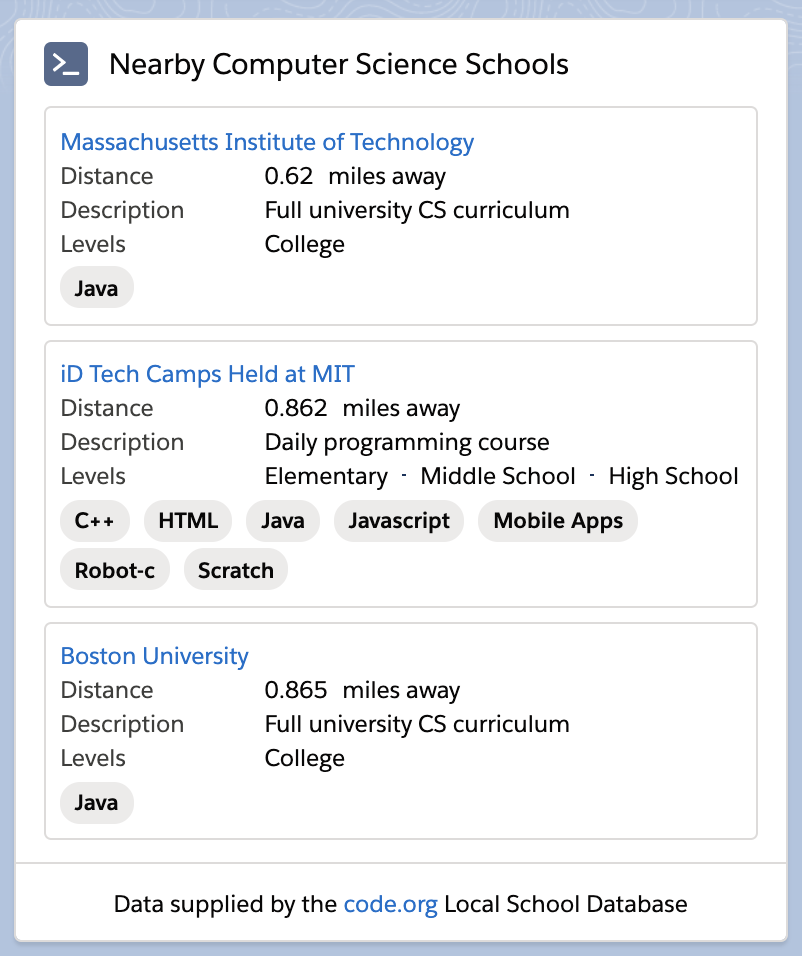

# Code.org Local School Search Lightning Web Component

This Lightning Web Component demonstrates a method for bringing external data into a Lightning Web Component. This component utilizes the code.org computer science school & program database to display the nearest three schools to a given property.


## About

Using the [Dreamhouse Sample App](https://github.com/trailheadapps/dreamhouse-lwc) from the [Trailhead Sample Gallery](https://trailhead.salesforce.com/sample-gallery) we can demonstrate how to bring data into a Lighting Web Component from a 3rd Party Library. Using the `Property__c` record in the app, we can pull a list of nearby computer science schools using the [Code.org Local Schools Databases API](https://code.org/learn/find-school/json).

This project relies on an API that is hosted on heroku, you can find the code and deploy your own version of the API in the [Code.org Schools Geolocation API](https://github.com/schandlergarcia/code-schools-api-golang) repo.



## Features

The component consists of the following:

- An Apex Callout to a 3rd Party API
- Lightning Data Services for getting a records details
- Apex wire adaptor to get data for a LWC
- Using base components to power a UI
- lightning-card
- lightning-tile
- lightning-badge
- lightning-spinner
- Using SLDS css utilities
  - slds-grid
  - vertical-list
  - horizontal-list
- Lightning Navigation Service
- Lightning Messaging Utility from [Salesforce Labs](https://github.com/schandlergarcia/lightning-messaging-utility)
  - Illustrations
  - Inline Error Handling

## Installation

This component requires that you have installed the [Dreamhouse Sample App](https://github.com/trailheadapps/dreamhouse-lwc) and the [Lightning Messaging Utility](https://github.com/schandlergarcia/lightning-messaging-utility) to install this component.

**Install Dreamhouse into a scratch org**

Follow along with the [Dreamhouse Quick Start](https://trailhead.salesforce.com/content/learn/projects/quick-start-dreamhouse-sample-app) on Trailhead.

**Clone this repository and push to your Dreamhouse org**

```
git clone https://github.com/schandlergarcia/code-school-search-lwc
cd code-school-search-lwc
sfdx force:source:push -u <dreamhouse org username>
```

**Clone the Lightning Messaging Utility repository and push to your Dreamhouse org**

```
git clone https://github.com/schandlergarcia/lightning-messaging-utility
cd lightning-messaging-utility
sfdx force:source:push -u <dreamhouse org username>
```

## Code Highlights

This component was designed to give you an introduction into designing and developing a Lightning Web Component around a use case that uses a 3rd party data source.

### 1) Apex Callout - LocalCodeSchoolSearch.cls

Implement an Apex `@AuraEnabled(Cacheable=true)` method that accepts the latitude and longitude as parameters from a LWC. It then takes those coordinates and appends them onto the url parameters of an endpoint. We then callout to the API and pass the raw response back to our LWC.

```apex
  @AuraEnabled(cacheable=true)
  public static String getNearbyCodeSchools(Decimal propertyLatitude, Decimal propertyLongitude) {
    // Construct our Callout URL with our Lat and Lon from the component
    String calloutURL = 'https://enigmatic-gorge-00974.herokuapp.com/?lat=' + propertyLatitude + '&lon=' + propertyLongitude;
    String response = calloutToGoServer(calloutUrl);
    return response;
  }
```

### 2) Import a reference to the search endpoint

Import a reference to the `search` Apex method in the lookup parent component's JS:

Utilize Lightning Data Services by importing the `getRecord` wire adapter and specifying the `Property__c.Location__Latitude__s` and `Property__c.Location__Longitude__s` fields to use as party of the query.

```js
import { getRecord } from "lightning/uiRecordApi";
const fields = ["Property__c.Location__Latitude__s", "Property__c.Location__Longitude__s"];
```

Annotate the `getRecord` function with `@wire` to enable it to be executed every time the `recordId` property is changed. The the response is then passed into the `property` constant where the latitude and longitude are assigned to the respective `latitude` and `longitude` properties.

```js

  @api recordId;
  latitude;
  longitude;

  @wire(getRecord, { recordId: "$recordId", fields })
  wiredRecord({ error, data }) {
    if (data) {
      const property = data.fields;
      this.latitude = property.Location__Latitude__s.value;
      this.longitude = property.Location__Longitude__s.value;
    } else if (error) {
      this.stopLoading(500);
      this.showError = true;
      this.errorMessage = error.message;
    }
  }

```

### 3) Call the `getNearbyCodeSchools` Apex Method from the LWC

Import the `getNearbyCodeSchools` method from the `LocalCodeSchoolSearch` Apex Class.

```js
import getNearbyCodeSchools from "@salesforce/apex/LocalCodeSchoolSearch.getNearbyCodeSchools";
```

Use an `@wire` adaptor to enable the `getNearbyCodeSchools` method to be called each time the components `latitude` or `longitude` properties have changed. In this instance, right after the `getRecord` adapter is called and the `latitude` or `longitude` properties are populated, the component will call the apex method and retrieve the response. The response is then parsed using `JSON.parse(response)` to get the data into a format we can use in the `localCodeSchools.html` template.

```js

  latitude;
  longitude;
  @track schools;

  @wire(getNearbyCodeSchools, {
    propertyLatitude: "$latitude",
    propertyLongitude: "$longitude"
  })
  wiredSchools({ error, data }) {
    if (data) {
      this.stopLoading(500);
      console.log(JSON.parse(data));
      this.schools = JSON.parse(data);
    } else if (error) {
      this.stopLoading(500);
      this.showError = true;
      this.error = error.message;
      this.schools = undefined;
    }
  }

```

### 4) Base components

The component relies on a number of base components from the [Component Library](https://developer.salesforce.com/docs/component-library/overview/components)

**lightning-card**
A Lightning Card component is used to wrap the body of the component, this gives the user a consistent experience with the way that salesforce exposes features into the UI. We have also specified a title and icon in the card. We have used the `slot="footer` to supply attribution to Code.org.

```xml
<lightning-card title="Nearby Computer Science Schools" icon-name="standard:apex">
  <div class="slds-var-p-left_medium slds-var-p-right_medium">
  <!-- Body -->
  </div>
  <div slot="footer">
    <p class="slds-text-align_center">
      Data supplied by the
      <a data-url="https://code.org/" onclick={navigateToUrl}> code.org </a>Local School Database
    </p>
  </div>
</lightning-card>
```

**lightning-tile**
A Lightning Tile is used to display each school record in the UI. We are iterating over the `schools` array using a `template for:each={schools}` iterator and hydrating the tiles with each item. We are using an html dataset property to expose the `url` of the `school` to the element using `data-url={school.website}`. We are handling the selection of the tile using the `navigateToUrl` function.

```xml
<lightning-tile label={school.name} onclick={navigateToUrl} data-url={school.website}>
  <!-- Body -->
</lightning-tile>
```

**lightning-badge**
A lightning Badge is used to display each language offered by the school. We are iterating over the `school.languages` array inside of the `schools` iteration. We are then hydrating the `lightning-badge` with the `language` value.

```xml
<ul class="slds-list_horizontal slds-wrap">
  <template for:each={school.languages} for:item="language" for:index="i">
    <li class="slds-item slds-var-p-right_x-small slds-var-p-top_xx-small" key={language.i}>
      <lightning-badge label={language}></lightning-badge>
    </li>
  </template>
</ul>
```

### 5) Navigate to a selected URL

Import a the `NavigationMixin` to enable Lightning Navigation Services in the LWC and extend the `LightningElement` with the mixin.

```js
import { NavigationMixin } from "lightning/navigation";

export default class LocalCodeSchools extends NavigationMixin(LightningElement) {}
```

Capture data from the `onclick={navigateToUrl}` and use the html dataset property to identify the `data-url` from the event. Assign the url to the `url` constant and use the NavigationMixin to navigate to the `standard__webPage` reference.

```js

  navigateToUrl(event) {
    const url = event.currentTarget.dataset.url;
    this[NavigationMixin.Navigate]({
      type: "standard__webPage",
      attributes: {
        url: url
      }
    });
  }

```

### 6) Conditional Rendering

The component uses `template if:true={property}` and `template if:false={property}` to conditionally hide and show aspects of the component.

```xml
<template>
  <lightning-card title="Nearby Computer Science Schools" icon-name="standard:apex">
    <template if:true={loading}>
    <!-- if the component is loading, show a spinner -->
    </template>
    <template if:false={loading}>
    <!-- If the component has finished loading, render the content -->
      <template if:true={showError}>
      <!-- If an error has occurred, show the message to the user -->
      </template>
      <template if:false={schools}>
      <!-- If no schools have been set, show an empty state illustration -->
      </template>
      <template if:true={schools}>
      <!-- If the schools property has been set, iterate over the schools -->
      </template>
    </template>
  </lightning-card>
</template>
```

## Code.org Local Schools API

Code.org makes their database available to give people the opportunity to use it to build their skills and get createive! Huge thanks to them for keeping this published and allowing the developer community to continue using it! Check it out here: [Code.org Local Schools Databases API](https://code.org/learn/find-school/json).
